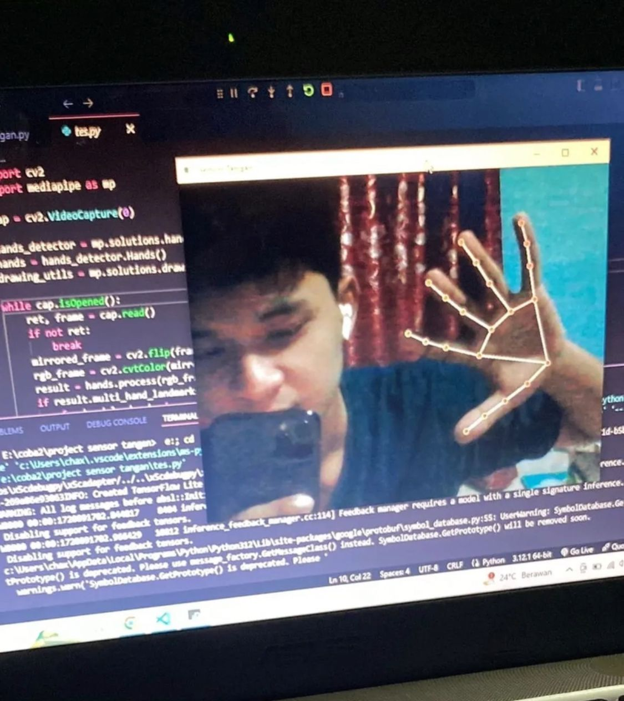

# 🖱️ Virtual Mouse dengan Deteksi Tangan 🖐️

Proyek ini menggunakan **OpenCV**, **Mediapipe**, dan **PyAutoGUI** untuk membuat kontrol mouse virtual berdasarkan gerakan tangan yang dideteksi melalui webcam. Dengan fitur ini, Anda dapat menggerakkan kursor dan melakukan klik hanya dengan jari telunjuk dan ibu jari.

---

## 🎥 Fitur Utama
- **Deteksi Tangan**: Menggunakan Mediapipe untuk mendeteksi tangan dan landmark jari.
- **Kontrol Kursor**: Menggerakkan kursor berdasarkan posisi jari telunjuk.
- **Klik Virtual**: Melakukan klik mouse dengan mendekatkan jari telunjuk dan ibu jari.
- **Interaksi Real-Time**: Respon cepat dari deteksi gerakan tangan.

---

## 🛠️ Library yang Diperlukan
Pastikan Anda telah menginstal library berikut sebelum menjalankan proyek:
1. [OpenCV](https://opencv.org/)
2. [Mediapipe](https://mediapipe.dev/)
3. [PyAutoGUI](https://pyautogui.readthedocs.io/)

Instalasi dapat dilakukan dengan perintah berikut:
```bash
pip install opencv-python mediapipe pyautogui
```

## 🚀 Cara Menggunakan
1. Clone repository ini
```bash
git clone https://github.com/MrChx/sensor
```
2. Pastikan Library Terinstal
3. Jalankan Program
```
python SensorEkspresi.py
python SensorTangan.py
python SensorWajah.py
```
## 📷 Foto Output
<div align="center">
    
</div>

